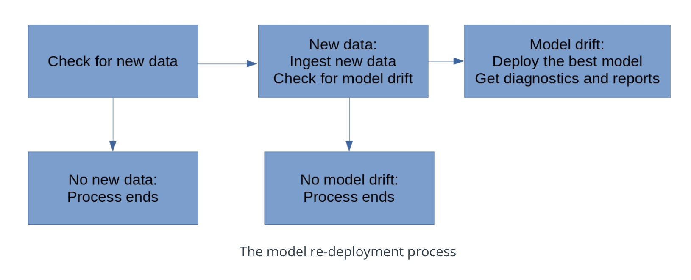

[](https://www.python.org/downloads/release/python-380/)
[](https://scikit-learn.org/0.24/whats_new/v0.24.html#version-0-24-1)
[](https://pypi.org/project/Flask/)

# Dynamic Risk Assessment System

Udacity Machine Learning DevOps Engineer project.

## Project Overview

### Background

Case of a company concerned about attrition risk: the risk that some of their clients will exit their contracts and 
decrease the company's revenue. If the client management team is small they're not able to stay in close 
contact with all their clients.

The company could find helpful to create, deploy, and monitor a risk assessment ML model that will estimate the 
attrition risk of each of the company's clients. If the model created and deployed is accurate, it will enable the 
client managers to contact the clients with the highest risk and avoid losing clients and revenue.

Creating and deploying the model isn't the end of our work, though. Most industries are dynamic and constantly changing, 
and a model that was created a year or a month ago might not still be accurate today. Because of this, we need to 
set up regular monitoring of the model to ensure that it remains accurate and up-to-date. We need to set up processes 
and scripts to re-train, re-deploy, monitor, and report on th ML model, so that the company can get risk assessments 
that are as accurate as possible and minimize client attrition.

### Project Steps Overview
The project is completed by proceeding through 5 steps:

- **Data ingestion**. Automatically check a database for new data that can be used for model training. Compile all 
training data to a training dataset and save it to persistent storage. Write metrics related to the completed data 
ingestion tasks to persistent storage.
- **Training, scoring, and deploying**. Write scripts that train an ML model that predicts attrition risk, and score the 
model. Write the model and the scoring metrics to persistent storage.
- **Diagnostics**. Determine and save summary statistics related to a dataset. Time the performance of model training and 
scoring scripts. Check for dependency changes and package updates.
- **Reporting**. Automatically generate plots and documents that report on model metrics. Provide an API endpoint that 
can return model predictions and metrics.
- **Process Automation**. Create a script and cron job that automatically run all previous steps at regular intervals.

## How to use this project in deployment

- We need to define the folder that will be used for storing new data and saving the model. For that purpose, we need 
to define in the **config.json** file:
  - `input_folder_path` entry for storing new data
  - `output_model_path` entry for storing production models
  - Executing **wsgi.py** will start the API:
  ```bash
  python3 wsgi.py
  ```
- We then run **fullprocess.py**:
  ```bash
  python3 fullprocess.py
  ```

## Data Ingestion
Data ingestion is important because all ML models require datasets for training. Instead of using a single, static 
dataset, we're going to create a script that's flexible enough to work with constantly changing sets of input files. 
This step will make the data ingestion go smoothly and easily, even if the data itself is complex.

In this step, we read data files into Python, and write them to an output file that will be the master dataset. 
We also save a record of the files that have been read.

When we're initially setting up the project, our config.json file will be set to read ```practicedata``` and write 
```practicemodels```. When we're ready to finish the project, we will need to change the locations specified in 
```config.json``` so that we're reading our actual, ```sourcedata``` and we're writing to our ```models``` directory.

### Reading Data and Compiling a Dataset
In the first part of the data ingestion.py script, we read a collection of csv files into Python.

The location of the csv files we'll be working with is specified in the config.json starter file, in an entry called 
`input_folder_path`. In the initial version of config.py, this entry's value is set to the `/practicedata/` directory.

The code in **ingestion.py**  automatically detects all of the csv files in 
the directory specified in the `input_folder_path`. Each of the files in the `input_folder_path` represents a 
different dataset. The data in all of these individual datasets is combined into a single pandas DataFrame.

It's possible that some of the datasets that weu read and combine will contain duplicate rows. So, we de-dupe 
the single pandas DataFrame we create, and ensure that it only contains unique rows.

### Writing the Dataset
Now that we have a single pandas DataFrame containing all of your data, we need to write that dataset to storage in 
our workspace. We save it to a file called **finaldata.csv**. Save this file to the directory that's specified in 
the `output_folder_path` entry of the **config.json** configuration file. In the initial version of **config.json**, 
the output_folder_path entry is set to `/ingesteddata/`, so the dataset will be saved to `/ingesteddata/`.

### Saving a record of the ingestion
We need to have a record of which files we read to create the **finaldata.csv** 
dataset. We create a record of all of the files we read in this step, and save the record as a Python list.

We store this record in a file called **ingestedfiles.txt**. This file contains a list of the filenames of 
every .csv that were read in the **ingestion.py** script. We save this file to the directory that's specified in 
the `output_folder_path entry` of the **config.json** configuration file.

## Training, Scoring, and Deploying an ML Model
Training and Scoring an ML model is important because ML models are only worth deploying if they've been trained, 
and we're always interested in re-training in the hope that we can improve our model accuracy. Re-training and scoring, 
as we'll do in this step, are crucial so we can get the highest possible model accuracy.

Three scripts are used for this step:
  - One script will be for training an ML model
  - another will be for generating scoring metrics for the model
  - the third will be for deploying the trained model.

The data in **finaldata.csv** represents records of corporations, their characteristics, and their historical attrition 
records. One row represents a hypothetical corporation. There are five columns in the dataset:
- "corporation", which contains four-character abbreviations for names of corporations
- "lastmonth_activity", which contains the level of activity associated with each corporation over the previous month
- "lastyear_activity", which contains the level of activity associated with each corporation over the previous year
- "number_of_employees", which contains the number of employees who work for the corporation
- "exited", which contains a record of whether the corporation exited their contract (1 indicates that the corporation 
exited, and 0 indicates that the corporation did not exit)

The dataset's final column, "exited", is the target variable for our predictions. The first column, "corporation", 
will not be used in modeling. The other three numeric columns will all be used as predictors in our ML model.

### Model Training
We build a function that accomplishes model training for an attrition risk assessment ML model. The model training 
function accomplishes the following:
- Read in **finaldata.csv** using the pandas module. The directory that we read from is specified in the `output_folder_path` 
of the `config.json` starter file.
- Use the scikit-learn module to train an ML model on the data. 
- Write the trained model the workspace, in a file called **trainedmodel.pkl**. The directory we'll save it in is 
specified in the `output_model_path` entry of the **config.json** file.

The code that accomplishes all of these steps is written in **training.py**.

### Model Scoring
In **scoring.py** we write a function that accomplishes model scoring. To accomplish model scoring, we do the following:
- Read in test data from the directory specified in the test_data_path of the **config.json** file
- Read in the trained ML model from the directory specified in the `output_model_path` entry of the **config.json** file
- Calculate the F1 score of the trained model on the testing data
- Write the F1 score to a file called **latestscore.txt**. This file is saved to the directory 
specified in the `output_model_path` entry of the **config.json** file

### Model Deployment
In **deployment.py** we write a function that will deploy the model. This model deployment function copies the trained 
model (**trainedmodel.pkl**), the model score (**latestscore.txt**), and a record of the ingested data 
(**ingestedfiles.txt**). It copies all three of these files from their original locations to a production deployment 
directory. The location of the production deployment directory is specified in the `prod_deployment_path` entry of the 
**config.json** file.

## Model and Data Diagnostics
Model and data diagnostics are important because they will help finding problems - if any exist - in the model and 
data. Finding and understanding any problems that might exist will help resolve the problems quickly and make sure 
that the model performs as well as possible.

In this step, we create a script that performs diagnostic tests related to the model as well as the data.

### Model Predictions
We write a function that returns predictions made by the deployed model. This function takes an argument that consists 
of a dataset, in a pandas DataFrame format. It reads the deployed model from the directory specified in the 
`prod_deployment_path` entry of the **config.json file**.

The function uses the deployed model to make predictions for each row of the input dataset. Its output is a 
list of predictions. This list has the same length as the number of rows in the input dataset.

### Summary statistics
We also write a function that calculates summary statistics on the data. The summary statistics calculated are means, 
medians, and standard deviations. We calculate each of these for each numeric column in the data.

This function calculates these summary statistics for the dataset stored in the directory specified by 
`output_folder_path` in **config.json**. It outputs a Python list containing all of the summary statistics for 
every numeric column of the input dataset.

### Missing Data
Next, we write a function to check for missing data. This function counts the number of NA values in 
each column of the dataset. Then, it calculates what percent of each column consists of NA values.

The function counts missing data for the dataset stored in the directory specified by `output_folder_path` in 
**config.json**. It returns a list with the same number of elements as the number of columns in the dataset. 
Each element of the list reflects the percent of NA values in a particular column of the data.

### Timing
Next, we write a function that times how long it takes to perform the important tasks of this project. 
The important tasks that are timed are: 
  - data ingestion
  - model training.

This function returns a Python list consisting of two timing measurements in seconds: one measurement for data 
ingestion, and one measurement for model training.

### Dependencies
It's important to make sure that the modules that are imported are up-to-date. We write a function that checks the 
current and latest versions of all the modules that the scripts use (the current version is recorded in 
`requirements.txt`). It outputs a table with three columns: 
- the first column will show the name of a Python module that is used 
- the second column will show the currently installed version of that Python module
- the third column will show the most recent available version of that Python module.

To get the best, most authoritative information about Python modules, we rely on Python's official package 
manager, pip. The script runs a pip command in our workspace Terminal to get the information we need for 
this step.

**Note**: Dependencies are not re-installed or changed, since this is just a check.

## Model Reporting
Model reporting is important because reporting allows us to be aware of all aspects of our data, 
our model, and our training processes, as well as their performance. Also, automated reporting enables us to keep 
stakeholders and leaders quickly and reliably informed about our ML efforts.

In this step, we write scripts that create reports related to the ML model, its performance, and related 
diagnostics.

### Generating Plots
The **reporting.py** script generates plots related to the ML model's performance.

In order to generate plots, we call the model prediction function in **diagnostics.py**. The function uses the test 
data from the directory specified in the `test_data_path` entry of the **config.json** file as input dataset. 
We use this function to obtain a list of predicted values from the model. After we obtain predicted values and actual 
values for the data, we use these to generate a confusion matrix plot. The **reporting.py** script saves the 
confusion matrix plot to a file called **confusionmatrix.png**. The **confusionmatrix.png** file is saved in the 
directory specified in the `output_model_path` entry of the **config.json** file.

## API Setup
We set up an API using **app.py** so that we can easily access ML diagnostics and results. The API has four endpoints: 
- one for model predictions: `/prediction`
- one for model scoring: `/scoring`
- one for summary statistics: `/summarystats`
- one for other diagnostics: `/diagnostics`

### Calling the API endpoints
The **apicalls.py** script calls each of the API endpoints, combine the outputs, and write the combined outputs to a 
file called **apireturns.txt**. The **apireturns.txt** file is saved in the directory specified in the 
`output_model_path` entry of the **config.json** file.

## Process automation
Process automation is important because it will eliminate the need for manually performing the individual steps of 
the ML model scoring, monitoring, and re-deployment process.

In this step, we create scripts that automate the ML model scoring and monitoring process. This includes checking for 
the criteria that will require model re-deployment, and re-deploying models as necessary. The full process that is 
automated is shown in the following figure:



### Updating config.json
For testing purposes the  **config.json** file contains an entry called `input_folder_path` with a value equal to 
`/practicedata/`. When testing, all of the training, scoring, and reporting  is accomplished relying on the contents 
of this directory. As the name "practicedata" suggests, this folder's datasets is provided to practice and test the 
scripts. Once all of the scripts have been completed, we want to stop working with practice data and start working with 
production data. Such production data can be found in the folder called `/sourcedata/`.

Changing from practice data to production data only requires changing one thing. We need to change the 
`input_folder_path` entry in the **config.json** file. Instead of `/practicedata/`, we need to change it to be 
`/sourcedata/`. Since all of the scripts read this value from **config.json**, making that one change will enable all 
of the scripts to work with this new, correct data instead of our practice data.

We also need to change the `output_model_path`. In the training version of **config.json**, the value for this entry 
is set to `/practicemodels/`. We should change it to `/models/` for storing production models instead of practice 
models.

### Checking and Reading New Data
We need to check whether any new data exists that needs to be ingested. We accomplish the check for new data in 
two steps:
- we read the file **ingestedfiles.txt** from the deployment directory, specified in the `prod_deployment_path` entry 
of the **config.json** file.
- we check the directory specified in the `input_folder_path` entry of **config.json**, and determine whether there are 
any files there that are not in the list from **ingestedfiles.txt**.

If there are any files in the `input_folder_path` directory that are not listed in **ingestedfiles.txt**, then we need 
to run the code in **ingestion.py** to ingest all the new data.

### Deciding Whether to Proceed (first time)
If we found in the previous step that there is no new data, then there will be no way to train a new model, and so 
there will be no need to continue with the rest of the deployment process. The script will only continue to the next 
step (checking for model drift) if we found and ingested new data in the previous step.

### Checking for Model Drift

We check for model drift by accomplishing the following steps:
- Read the score from the latest model, recorded in **latestscore.txt** from the deployment directory, specified in 
the `prod_deployment_path` entry of the **config.json** file.
- Make predictions using the **trainedmodel.pkl** model in the `/production_deployment` directory and the most recent 
data we obtained from the previous "Checking and Reading New Data" step.
- Get a score for the new predictions by running the **scoring.py**.
- Check whether the new score is higher or lower than the score recorded in **latestscore.txt** using the raw 
comparison test. If the new score from is lower, then model drift has occurred. Otherwise, it has not.

### Deciding Whether to Proceed (second time)
If we found in the previous step that there is no model drift, then the current model is working well and there's no 
need to replace it, so there will be no need to continue with the rest of the deployment process. Our script will only 
continue to the next step (re-training and re-deployment) if we found evidence for model drift in the previous step.

### Re-training
We Train a new model using the most recent data we obtained from the previous step. We run **training.py** to complete 
this step. When we run **training.py**, a model trained on the most recent data will be saved in the `output_model_path` 
entry of the **config.json** file.

### Re-deployment
To perform re-deployment, we need to run the script called **deployment.py**. The model we need to deploy is the model 
we saved when we ran training.py in the "Re-training" section above.

### Diagnostics and Reporting
The last part of the script runs the code from **apicalls.py** and **reporting.py** on the most recently deployed model 
(the model deployed in the previous "re-deployment" section). When we run **reporting.p**y, we'll create a new version of 
**confusionmatrix.png**, which will be saved in the `/models/` directory. When we run **apicalls.py**, we'll create a 
new version of **apireturns.txt**, which will be saved in the `/models/` directory.

### Cron job for the full pipeline
The script, **fullprocess.py**, accomplishes all of the important steps in the model deployment, scoring, and 
monitoring process. But it's not enough just to have the script sitting in our workspace - we need to make sure the 
script runs regularly without manual intervention. To accomplish this, we'll write a crontab file that runs the 
**fullprocess.py** script one time every 10 min. 

To successfully install a crontab file that runs the **fullprocess.py** script, we need to make sure to do the 
following:
- In the command line of the workspace, run the following command: `service cron start`
- Open the workspace's crontab file by running `crontab -e` in the workspace's command line. 
- If you want to view your crontab file, you can run `crontab -l` on the command line.

## Future improvements

### PDF reports
We set up a script that generates a plot of a confusion matrix. Instead of outputting just that 
raw plot, we could set up a script that generates a pdf file that contains the plot as well as summary statistics and 
other diagnostics. This enables more complete, quicker reporting.

In order to accomplish this suggestion, we'll need to add to our **reporting.py** Python script. We may also need to 
install modules that enable PDF creation, such as the reportlab module. There are many things we could include in a 
PDF report about our model: we could include the confusion matrix we generate in **reporting.py**, we could include 
all of the outputs of API endpoints we created in **app.py**, and we could also include the model's F1 score 
(stored in **latestscore.txt**) and the files that we ingested to train the model (stored in **ingestedfiles.txt**).

### Time trends
We coud give the scripts the ability to store diagnostics from previous iterations of the model, and generate reports 
about time trends. For example, show how the percent of NA elements has gone up or down over many weeks or months, or 
show whether the timing of ingestion and training has increased or decreased.

We could accomplish this suggestion in several different ways. For example, we could create a directory 
called `/olddiagnostics/`, and create a script that copied all of the diagnostics outputs to that folder. We could also 
add timestamps to the filenames of the output files like **ingestedfiles.txt** and **latestscore.txt**.

### Database setup
Instead of writing results and files to .txt and .csv files, we could write our datasets and records to SQL databases. 
This will lead to increased performance and reliability.

In order to accomplish this suggestion, we'll have to set up SQL databases in out workspace. We can accomplish this 
within Python by installing and using the mysql-connector-python module. We could create a new Python script called 
**dbsetup.py** that used this module to set up databases. We could set up a database that stored information about 
ingested files, another one to store information about model scores, and another one to store information about 
model diagnostics. Then, we would have to alter **ingestion.py**, **scoring.py**, and **diagnostics.py** so that they 
wrote to these databases every time they were run.